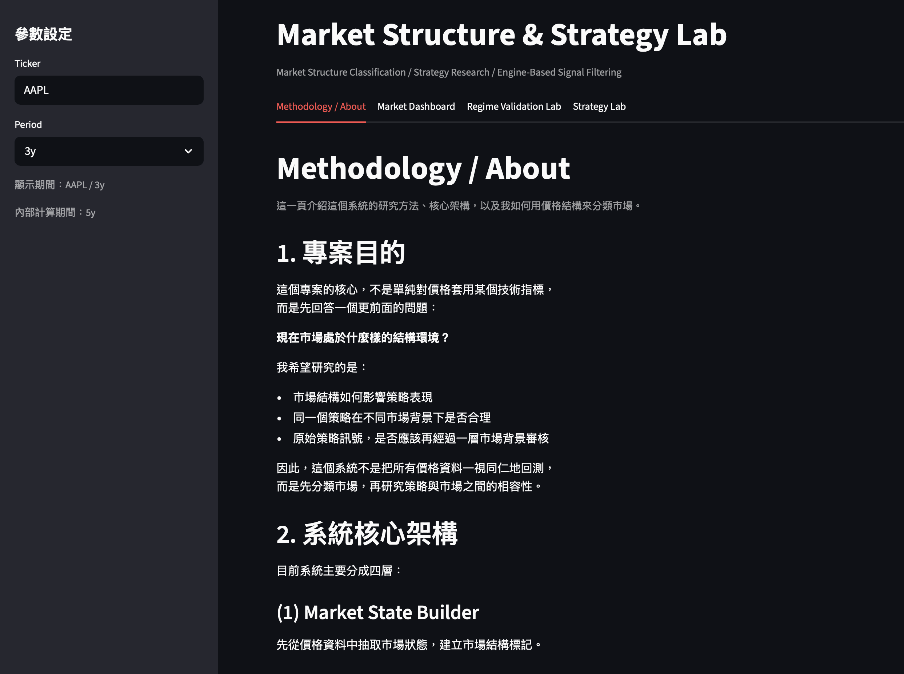
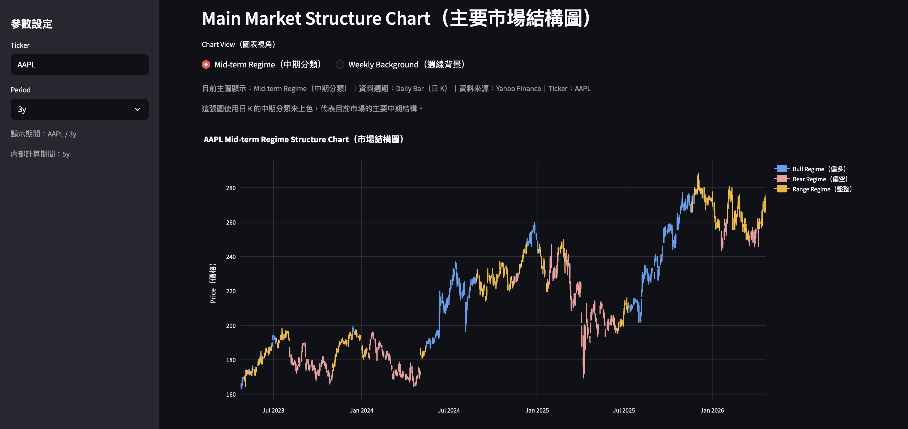
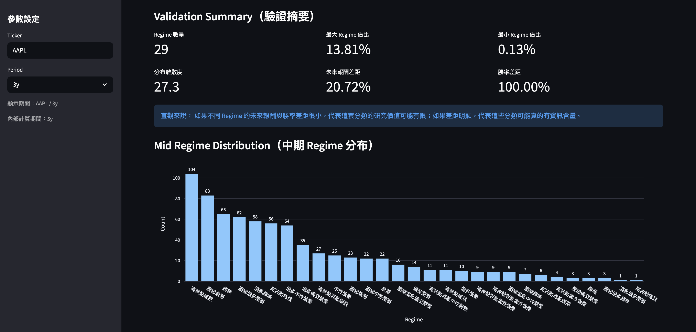
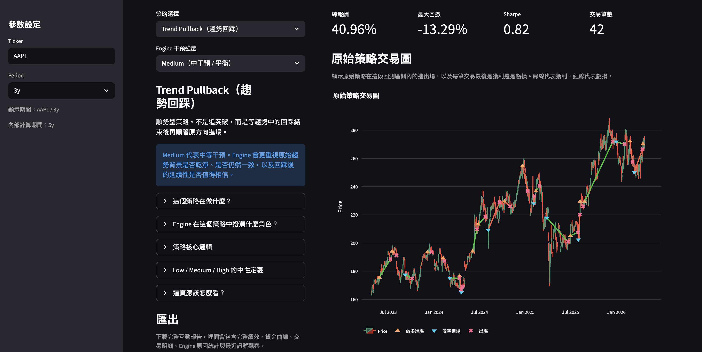

# Market Structure & Strategy Lab

A market-structure-driven trading research and visualization system built with Python and Streamlit.

This project is built around one core idea:

**Do not treat every market environment the same.  
Classify market structure first, then study whether a strategy is compatible with that environment.**

---

## Overview

This system is designed to study the relationship between:

- market structure
- strategy type
- engine-based signal filtering
- backtest behavior

Instead of applying one strategy to all price data equally, the workflow is:

1. build market-state labels from price structure
2. generate raw strategy signals
3. use an Engine layer to evaluate whether those signals are reasonable under the current background
4. compare original vs engine-filtered trades in an interactive Strategy Lab

The current version focuses on two strategy families:

- **Trend Breakout**
- **Trend Pullback**

---

## Product Preview

### 1. Methodology / About
A dedicated introduction page explaining the system’s research philosophy, market classification logic, and the role of strategies and engine filtering.



### 2. Market Dashboard
A market overview interface for inspecting current structure, background, and regime-related information.



### 3. Regime Validation Lab
A validation workspace for reviewing whether the regime classification framework is structurally consistent across historical data.



### 4. Strategy Lab
An interactive strategy research page comparing raw strategy trades and engine-filtered trades with detailed trade explanations.



---

## Project Motivation

Traditional backtests often assume that a strategy should behave the same way across all market conditions.

In practice, that is rarely true.

For example:

- a breakout signal is more natural when the market is transitioning into directional expansion
- a pullback signal is more natural when the existing trend remains healthy
- the same raw entry can have very different quality depending on the surrounding market structure

This project was built to separate:

- **strategy signal generation**
- **market structure classification**
- **engine-based context filtering**

So the research question is not only:

> Did the signal make money?

but also:

> Was the signal structurally reasonable in the first place?

---

## Core Architecture

The system is divided into four layers.

### 1. Market State Builder
Builds a market-state dataframe from price data.

This layer is responsible for classifying market structure into multiple context layers, including:

- mid-term structure
- weekly background
- fast events

### 2. Strategy Layer
Generates raw strategy signals based on price structure.

Current strategies:

- `trend_breakout`
- `trend_pullback`

### 3. Engine Layer
The Engine does not invent strategies.  
Its role is to evaluate whether a raw strategy signal is reasonable under the current market environment.

It can:

- allow entry
- allow entry cautiously
- reduce holding strength
- force early exit
- block entry

### 4. Strategy Lab
An interactive research interface for comparing:

- original strategy trades
- engine-filtered trades
- blocked entries
- trade-level performance
- trade logs
- recent signals and explanations

---

## How Market Classification Works

This project does **not** define bullish or bearish market states using a single indicator.

Instead, it treats market classification as a **price-structure interpretation problem**.

The idea is:

- extract structural features from price
- interpret whether those features collectively look more like bullish structure, bearish structure, range, compression, or mixed volatility

### Examples of structural information considered

- price position relative to moving averages
- moving average slope
- recent swing structure
- range width and compression behavior
- directional consistency
- volatility behavior
- whether price action looks stable, compressed, expanding, or chaotic

### What “bullish” means in this system

A market is not labeled bullish because of one rule alone.

It becomes more consistent with a bullish structure when multiple features point in the same direction, such as:

- price holding relatively favorable position
- structural direction leaning upward
- highs and lows shifting upward more consistently
- limited signs of structural chaos

### What “bearish” means in this system

Similarly, bearish structure means multiple price-structure features jointly suggest:

- weaker price position
- downward structural direction
- lows continuing to shift lower
- directional pressure leaning bearish

### If direction is unclear

If the market lacks directional consistency, repeatedly returns to the middle of the range, or shows compression / noisy expansion without clean continuation, it is more likely to be interpreted as:

- neutral range
- compressed neutral
- high-volatility mixed structure

In other words, this system is not trying to predict every next bar.  
It is trying to quantify what the **current price behavior most resembles structurally**.

---

## Market Classification Layers

The current framework uses a multi-layer market-state idea.

### 1. Mid-Term Structure
This layer answers:

> What kind of structure is currently dominant?

Examples:

- bullish structure
- bearish structure
- neutral range
- compressed neutral
- high-volatility mixed structure

### 2. Weekly Background
This layer provides a slower and broader background context.

It helps answer:

> Does the higher-timeframe background support or conflict with the trade idea?

### 3. Fast Events
This layer detects abnormal or sudden short-term behavior.

Examples:

- upward burst
- downward burst
- volatility shock
- structural break

It helps answer:

> Is something unusual happening right now that should override a normal strategy response?

---

## Current Strategies

### 1. Trend Breakout
A trend-following strategy designed to participate after price breaks important recent structure.

Core idea:

- capture directional expansion after structure release
- avoid relying on fixed take-profit / stop-loss logic
- exit when recent swing structure is broken

### 2. Trend Pullback
A trend-following strategy that waits for a pullback inside an existing trend, then enters when price resumes in the original direction.

Core idea:

- avoid chasing the most extended breakout bar
- participate when a healthy trend pulls back and re-strengthens
- exit when supporting structure fails

---

## What the Engine Does

The Engine is one of the main differentiators of this project.

A raw strategy signal is **not** automatically treated as a final trade.

The Engine asks:

- Is this entry compatible with current structure?
- Is the broader background supportive?
- Is there a fast event that makes this trade dangerous?
- Should this trade be reduced, blocked, or exited early?

This allows the system to compare:

- what the strategy wanted to do
- what the market background allowed it to do

That comparison is visible in the Strategy Lab through:

- original strategy trade chart
- engine-filtered trade chart
- blocked trade visualization
- exit explanations
- trade performance comparison

---

## Strategy Lab Features

The Strategy Lab is designed to make strategy research more visual and interpretable.

Current features include:

- backtest period selection
- original vs engine-filtered trade charts
- blocked-entry visualization
- cumulative equity comparison
- performance summary
- trade logs
- recent signal inspection
- hover-based explanations for entries, exits, and blocked trades

---

## Tech Stack

- Python
- Pandas
- NumPy
- Streamlit
- Plotly

---

## Run Locally

### 1. Create and activate virtual environment

```bash
python3 -m venv .venv
source .venv/bin/activate


Project demo: https://market-structure-strategy-lab.streamlit.app
